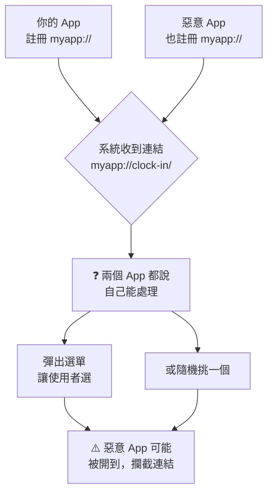
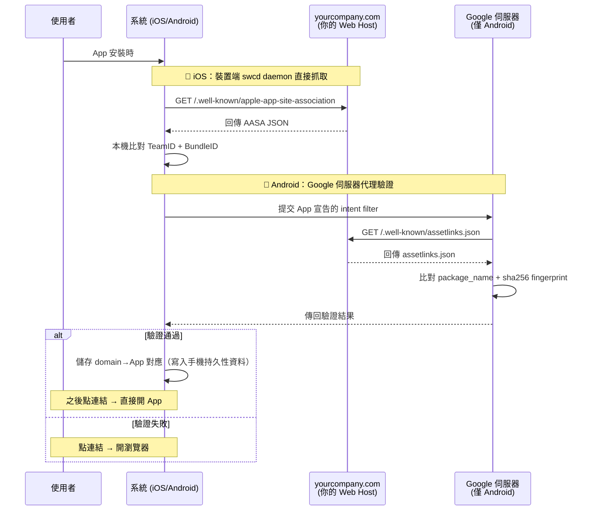
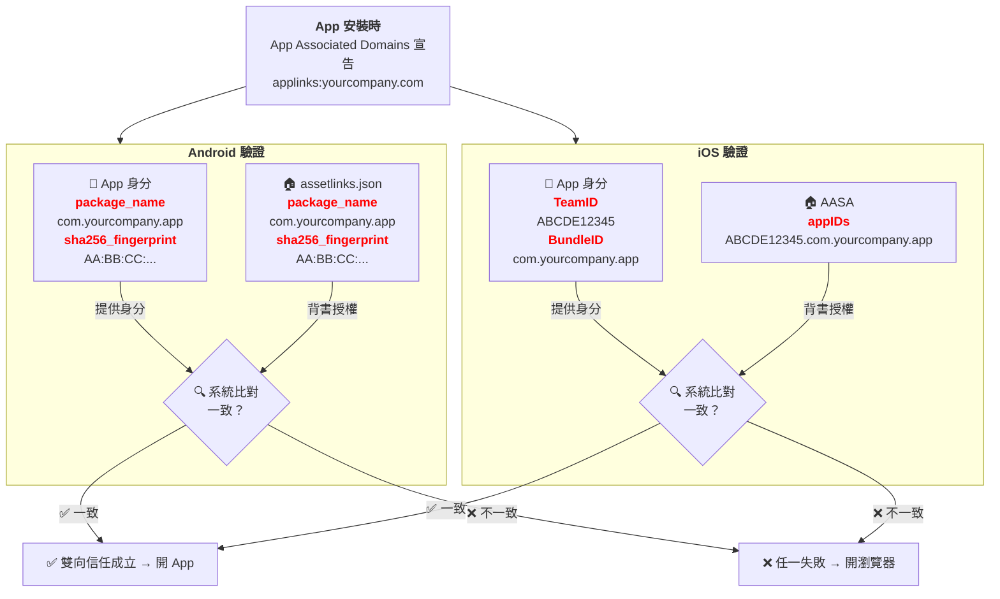
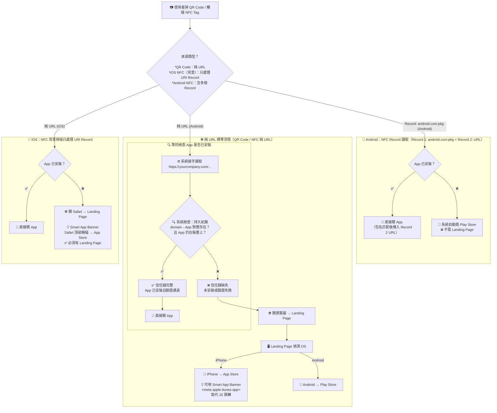
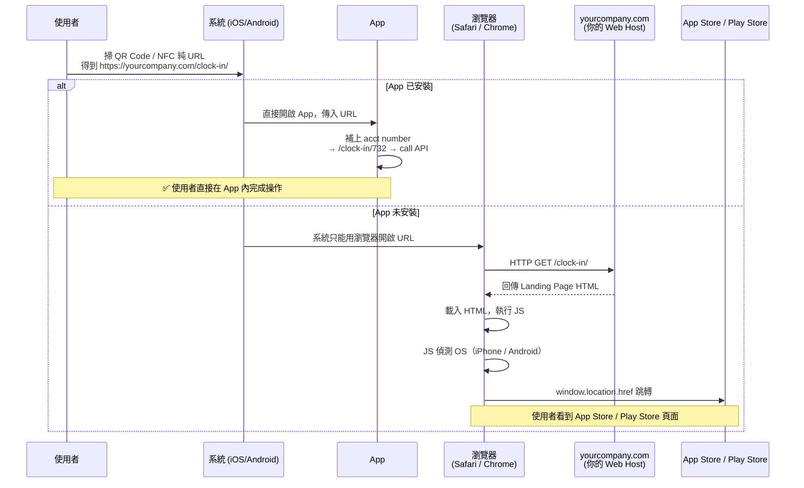
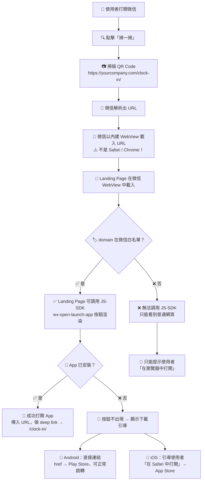
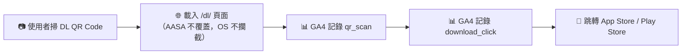

# Universal Links (iOS) / App Links (Android) 完整流程說明

# 一、目錄

1. [URL Scheme vs Universal Links / App Links](#二url-scheme-vs-universal-links--app-links)
2. [三大必要元件](#三三大必要元件)
3. [完整流程圖](#四完整流程圖)
4. [iOS 設定清單](#五ios-設定清單)
5. [Android 設定清單](#六android-設定清單)
6. [Landing Page — 未安裝導向商店](#七landing-page--未安裝導向商店)
7. [.well-known 路徑與 Core Router 注意事項](#八well-known-路徑與-core-router-注意事項)
8. [常見踩坑與個人見解](#九常見踩坑與個人見解)
9. [微信（WeChat）QR Code 掃碼處理](#十一微信wechat-qr-code-掃碼處理)
10. [驗證檢查清單](#十驗證檢查清單)
11. [Google Analytics 4 + UTM — QR Code 轉化率追蹤](#十二google-analytics-4-ga4--utm--qr-code-掃碼轉化率追蹤)
12. [小結](#十三小結)

---

# 二、URL Scheme vs Universal Links / App Links

## 1. 兩者對照總覽

初學者容易把 URL Scheme（如 `myapp://`）跟 Universal Links / App Links（如 `https://yourcompany.com`）混為一談，但它們是完全不同的機制：

| | URL Scheme | Universal Links / App Links |
|---|---|---|
| **格式** | `myapp://clock-in/` | `https://yourcompany.com/clock-in/` |
| **需要驗證檔？** | ❌ 不需要 | ✅ 需要 assetlinks.json / AASA |
| **需要 Web Host？** | ❌ 不需要 | ✅ 需要 HTTPS domain |
| **安全性** | 低 — 任何 App 都可以註冊同一個 scheme | 高 — 只有 domain 主人授權的 App 能處理 |
| **App 沒安裝時** | 顯示錯誤 / 沒反應 | 自動在瀏覽器開 Landing Page，可導去商店 |
| **適合場景** | 內部測試、App 內跳轉 | 正式產品、對外分享連結 |

## 2. URL Scheme 的問題

`myapp://` 這類自定義 scheme 最大的問題是**沒有擁有權的概念**。舉例：



不像 `https://yourcompany.com` 需要你真的擁有那個 domain 才能放驗證檔，`myapp://` 就是一個任意的字串，沒有任何人「擁有」它。任何惡意 App 都可以宣告自己處理 `myapp://`，趁機攔截你的連結、甚至偽造你的 App 行為。

而且如果 App 沒安裝，點了 `myapp://` 的連結就什麼都不會發生（或顯示錯誤），完全無法做 fallback 處理。

## 3. Universal Links / App Links 的優勢

`https://` 連結的本質決定了它更安全：

1. **domain 有擁有權**：只有你真的擁有 `yourcompany.com`，才能放驗證檔、才能被系統信任。別人的 App 無法冒充。
2. **沒 App 也有 fallback**：因為是標準 HTTPS URL，App 沒裝時瀏覽器照樣能打開，你的 Landing Page 可以接手導去商店。
3. **使用者體驗一致**：使用者看到的一律是 `https://` 連結，不用猜這個連結會不會開 App。

## 4. 什麼時候用哪個？

| 場景 | 推薦 |
|---|---|
| 正式對外 QR Code / NFC / 分享連結 | Universal Links / App Links |
| App 內頁面跳轉 | URL Scheme 或內部路由即可 |
| 開發階段快速測試 | URL Scheme（`xcrun simctl openurl` / `adb shell am start`） |

> **簡單記**：對外的連結一律用 `https://`（Universal Links / App Links），不要用 `myapp://`。

---

# 三、三大必要元件

## 1. 元件總覽

| 元件 | 是否必要 | 角色 |
|---|---|---|
| **App Associated Domains**（App 端聲明） | ✅ 必要 | App 必須宣告「我能處理這個domain」，否則系統不會把連結交給 App |
| **Web Host**（你的domain，HTTPS） | ✅ 必要 | 驗證檔必須掛在這個domain上，且系統會主動來抓 |
| **assetlinks.json**（Android）/ **AASA**（iOS） | ✅ 必要 | domain端授權檔，沒有它系統無法建立信任，連結只會開瀏覽器 |

**這三樣全部都是必須的，缺一不可。** 這就是整套機制的設計核心：雙向信任。

### I. App Associated Domains — 誰來處理？

這是 **App 端的主動宣告**。App 在打包時就在自己的設定檔中說：「我願意、也有能力處理來自 `yourcompany.com` 的連結」。

#### a. 角色

告訴系統一個意圖，但系統不會單方面相信 App 說的話。

#### b. 只有宣告、沒有驗證檔會怎樣

系統會認為 App 在說謊（惡意 App 可能想劫持別人網站的流量），所以**不會交給 App**。

### II. Web Host（domain，HTTPS）— 憑什麼相信？

這是**信任的物理載體**。`yourcompany.com` 這個domain你必須真的擁有並控制，因為驗證檔（也就是 `assetlinks.json` / AASA）必須掛在 `yourcompany.com` 這個domain上面。

先說最核心的概念：**系統（Apple / Google）不認識你、也不認識你的 App。它能相信的唯一客觀事實，就是「這個domain的擁有者放了這個驗證檔」。** 因為只有domain的真正擁有者，才能在那個domain的伺服器上放檔案。

#### a. domain是什麼？為什麼它能當信任基礎？

```
https://yourcompany.com/.well-known/assetlinks.json
  ↑          ↑                                      ↑
  協定      domain（你擁有、你控制）                    路徑（你放的檔案）
```

- domain（Domain）是你在網路上的「地址」，具有全球唯一性——全世界不會有第二個人同時擁有 `yourcompany.com`。
- 要讓這個domain能被訪問，你需要做兩件事：
  1. **DNS 設定**：告訴全世界「這個domain指向哪台伺服器的 IP」。這個 IP 就是 `yourcompany.com` 伺服器的 IP，等於把 domain 跟你的機器綁在一起。
  2. **伺服器（Web Host）**：真的有一台機器在接請求、回傳內容。對這套機制來說，伺服器的作用就是兩件事：
     - Apple / Google 來打 `/.well-known/...` 時，回傳 JSON 內容給他們 → 完成驗證。
      - 沒裝 App 的使用者點連結時，回傳 Landing Page → 偵測 OS 並導去商店。（Android NFC Record 除外，系統會自動跳 Play Store）
- 這兩件事同時做到，才能證明你對這個domain有控制權。所以把驗證檔掛在domain下，是一個**牢不可破的身份證明方式**。

> Apple 和 Google 強制要求 HTTPS，HTTP 直接無視。

#### b. 系統實際上是怎麼「來抓」的？

這一步對新手來說最容易有誤解——不是使用者的瀏覽器每次點連結才抓。iOS 由裝置端 swcd daemon 自己抓取，Android 由 Google 伺服器代理驗證：



> **重點**：兩種平台的抓取方式不同：
> - **iOS**：裝置端的 `swcd` daemon 自己打 HTTPS 去抓 AASA，經過 Apple CDN 快取（快取時間不固定，有時長達數天）。
> - **Android**：Google 伺服器代勞，去抓 assetlinks.json 並比對，結果傳回裝置（約每 24 小時重抓一次）。
>
> 兩種平台都不是使用者每次點連結才抓，所以更新驗證檔後不會立刻對已安裝裝置生效。

#### c. 所以你需要在 Web Host 上做什麼？

1. **買一個domain**（或已有），確保 HTTPS 能正常訪問。
2. **架設 SSL 憑證**（用 Let's Encrypt 免費、或用雲端服務商內建的）。
3. **把 `.well-known/` 目錄放到網站的根目錄下**，放上對應的驗證檔。
4. **確保路徑不被擋**：沒有認證牆、沒有 redirect、沒有 middleware 改寫內容。

> **Web Host 可以是什麼？** 只要是一台能對外提供 HTTPS 服務的機器都行——阿里雲 ECS、AWS EC2、騰訊雲 CVM、甚至 GitHub Pages 或 Vercel 等靜態託管服務。重點不是機器在哪，而是它能讓 Apple/Google 透過 HTTPS 讀到 `/.well-known/` 底下的 JSON 檔。

> **一句話總結**：domain + HTTPS 就是整個機制的「物質基礎」。沒有它，App 的宣告和驗證檔都無處可掛，信任鏈無從建立。

### III. assetlinks.json / AASA — 到底誰說了算？

這是**domain主人的授權書**。內容明確寫著：「我，`yourcompany.com` 這個domain的擁有者，授權 package name 為 `com.yourcompany.app`、簽章 fingerprint 為 `AA:BB:CC:...` 的 App 來處理我的連結」。

它的角色是**完成雙向信任的最後一塊拼圖**：domain端背書 App 端的宣告。

#### a. 驗證邏輯：兩邊對答案

每個 App 在打包時，本身就帶有兩個身份資訊。

**Android 端**：`package_name` + `sha256_cert_fingerprints`

- **package_name**：App 的唯一識別碼，在 AndroidManifest.xml 裡定義，格式像 `com.yourcompany.app`。Google Play 上不會有兩個 App 用同一個 package name。
- **sha256_cert_fingerprints**：App 簽章金鑰的 SHA256 指紋。每次你發布 App，都必須用一把金鑰簽名。系統比對這組指紋來確認「這個 App 真的是用同一把金鑰簽的」。注意：如果用 Google Play App Signing，這把金鑰是 Google 的，不是你本機那把。

**iOS 端**：`Team ID` + `Bundle ID`

- **Team ID**：你的 Apple Developer 帳號的唯一識別碼，是一組英數組成的字串（例如 `ABCDE12345`）。一個公司/團隊只會有一個 Team ID，名下所有 App 共用。可以在 [Apple Developer Console](https://developer.apple.com/account) → Membership 找到。
- **Bundle ID**：App 的唯一識別碼，在 Xcode 專案裡設定，格式像 `com.yourcompany.app`。跟 Android 的 package name 概念一樣，App Store 上不會有兩個 App 用同一個 Bundle ID。

在 AASA 裡，這兩個合在一起寫成 `appIDs: ["TEAMID.BundleID"]`，例如 `"ABCDE12345.com.yourcompany.app"`。

**系統做的事**就是比對這兩邊 — App 端的身份 vs domain 端的授權，兩邊必須完全一致：



兩邊一致 → 信任。任一邊對不上（package name/Bundle ID 寫錯、fingerprint 是本機 debug key 而非上架用 key、Team ID 不是你的）→ 不信任。

### IV. 小結：缺一個會怎樣？

| 缺了... | 結果 |
|---|---|
| 缺 App 端宣告 | 系統根本不知道有 App 能處理這個domain → 開瀏覽器 |
| 缺 Web Host | 驗證檔無處可放，系統無法驗證 → 開瀏覽器 |
| 缺 assetlinks.json / AASA | App 有宣告、domain也在，但沒人背書 → 系統不信任 → 開瀏覽器 |
| 三者都有但對不上 | 例如 fingerprint 填錯 → 系統驗證失敗 → 開瀏覽器 |

> 核心邏輯：系統不是相信 App，也不是相信domain，而是相信 **「App 說的」跟「domain主人說的」之間的一致性**。

---

# 四、完整流程圖



## 1. OS 如何知道「App 已安裝」？

流程圖中多次出現「App 已安裝？」這個判斷，但 OS 是怎麼知道的？答案取決於走哪條路徑：

**純 URL 路徑（Universal Links / App Links）**

App 首次安裝後，系統看到 App 的 Associated Domains 宣告，會去 Apple/Google 伺服器抓對應 domain 的驗證檔（AASA / assetlinks.json），比對通過後 OS 將 **「domain → App」的對應關係持久儲存**（寫入永久性儲存空間，重開機不消失）。

使用者點連結時，OS 做兩件事：

1. 查「這個 domain 有沒有已驗證的 App？」（持久紀錄）
2. 查「那個 App 現在還在裝置上嗎？」（即時查系統的 App 登錄）

兩個都 Yes → 開 App；任一 No → 開瀏覽器。App 刪除時，這兩條會一起清除。

> **「開瀏覽器」是開原本那個 URL**（如 `https://yourcompany.com/clock-in/`），也就是你的 Landing Page，不是開 `/.well-known/assetlinks.json` 或 AASA。驗證檔只給 Apple/Google 伺服器背景抓取，使用者永遠不會看到。
>
> 驗證是 **一次性的伺服器端比對**（發生在 App 安裝後），裝置只儲存比對結果。Apple/Google 會定期重抓 domain 端的驗證檔來刷新他們的 CDN 快取（Android 約每 24 小時，iOS 時間不固定），但這不表示裝置每次都重新驗證。只有當 domain 端的驗證檔內容變更（比如你移除了某個 App 的授權），伺服器端快取刷新後，裝置才可能在後續某個時機得知變更。

> 這也是為什麼更新驗證檔後不會立刻生效——已安裝的裝置上持久紀錄還在，要等 Apple/Google 背景重新驗證後才會更新。

**NFC Record 路徑（Android NFC 專屬）**

NFC tag 支援寫入多個 NDEF Record（Record 1, Record 2, Record 3...），彼此獨立、可被系統依序讀取。Android 可以利用這個機制，在同一顆 tag 上放兩個 Record：

- **Record 1**：Android External Type（`android.com:pkg`），內容為 `package_name`（如 `com.yourcompany.app`）
- **Record 2**：純 URL（如 `https://yourcompany.com/clock-in/`）

Android 讀到 Record 1 後，直接用 package_name 查已安裝 App：
- 有這個 package → 開 App，並傳入 Record 2 的 URL 做 deep link
- 沒有這個 package → 自動跳 Play Store（不需 domain 驗證那一層）

iOS 在背景 NFC 掃描時不認得 Record 1（`android.com:pkg` 是 Android 私有格式），會跳過它、改讀 Record 2 的 URL → Safari → Landing Page。（若 App 已在前景開啟並使用 Core NFC API，則可讀取任何 NDEF Record，但此情境已脫離 Universal Link 的範圍。）

> **一顆 NFC Tag，兩種策略並存**：Record 1 讓 Android 免 Landing Page 直達 Play Store；Record 2 讓 iOS 走 URL → Landing Page → Smart App Banner。兩個 Record 互不干擾，各取所需。
>
> NDEF 標準並未規定 Record 的數量、類型或順序。以上 `android.com:pkg` + URL 是實務上常見組合，並非強制規範。

> **重點**：
> - **NFC Record（Android）**：在 tag 上寫入 `android.com:pkg` Record 帶 `package_name`，沒安裝 App 時系統自動跳 Play Store，**不需 Landing Page**。iOS 背景 NFC 掃描會跳過此 Record。
> - **純 URL**（QR Code 或 NFC 純 URL Record）：系統無法預知 target，只能開瀏覽器 → **必須有 Landing Page** 負責導向商店。
> - **iOS**：背景 NFC 掃描只處理 URI Record，`android.com:pkg` 會被跳過 → **一定要 Landing Page**。可用 Smart App Banner（`<meta name="apple-itunes-app">`）改善體驗，但本質仍需頁面載入。

---

# 五、iOS 設定清單

## 1. Xcode — Associated Domains

`Xcode → Signing & Capabilities → Associated Domains`

```
applinks:yourcompany.com
```

## 2. AASA 檔（Apple App Site Association）

路徑：`https://yourcompany.com/.well-known/apple-app-site-association`

- **必須 HTTPS**
- **無重定向**
- **Content-Type: `application/json`**（有些 CDN 預設 `text/plain`，會導致驗證失敗）
- **檔名不能有副檔名**（就是 `apple-app-site-association`，不是 `apple-app-site-association.json`）

> ⚠️ **以下即為 AASA 檔的完整內容 — domain 端的授權 JSON，系統比對的依據：**

```json
{
  "applinks": {
    "details": [
      {
        "appIDs": ["ABCDE12345.com.yourcompany.app"],
        "components": [
          { "/": "/clock-in/*" },
          { "/": "/*" }
        ]
      }
    ]
  }
}
```

> `ABCDE12345` 是你的 Apple Developer Team ID

---

# 六、Android 設定清單

## 1. AndroidManifest.xml — Intent Filter

```xml
<manifest xmlns:android="http://schemas.android.com/apk/res/android"
    package="com.yourcompany.app">   <!-- ⬅ package_name：與 assetlinks.json 比對的關鍵 -->

    <application>
        <activity>
            <intent-filter android:autoVerify="true"> <!-- 是關鍵 — 沒有它系統不會自動驗證 -->
                <action android:name="android.intent.action.VIEW" />
                <category android:name="android.intent.category.DEFAULT" />
                <category android:name="android.intent.category.BROWSABLE" />
                <data android:scheme="https"
                      android:host="yourcompany.com" />
            </intent-filter>
        </activity>
    </application>
</manifest>
```

## 2. assetlinks.json

路徑：`https://yourcompany.com/.well-known/assetlinks.json`

```json
[
  {
    "relation": ["delegate_permission/common.handle_all_urls"],
    "target": {
      "namespace": "android_app",
      "package_name": "com.yourcompany.app",
      "sha256_cert_fingerprints": [
        "AA:BB:CC:DD:EE:FF:00:11:22:33:44:55:66:77:88:99:AA:BB:CC:DD:EE:FF:00:11:22:33:44:55:66:77:88:99"
      ]
    }
  }
]
```

> ⚠️ **`sha256_cert_fingerprints` 要填正式簽章的 fingerprint。**  
> 如果你用了 Google Play App Signing，要填 Google 那把金鑰的 SHA256（在 Google Play Console → Setup → App Integrity 可以找到），不是你本機 debug/release keystore 那把自己生出來的。

---

# 七、Landing Page — 未安裝導向商店

**重點：Universal Links / App Links 本身「不會」自動把使用者導去商店下載。**  
系統在沒安裝 App 時，只會把它當普通網址用瀏覽器開。你的 Landing Page 要自己處理這段。

> **跳轉是 Landing Page 做的，不是 App 做的。** 這條路徑上 App 根本沒安裝，App 的程式碼完全不會被執行。跳轉邏輯是寫在 Landing Page 的 JS 裡（`window.location.href`），由瀏覽器執行。

## 1. Landing Page 是什麼？寫在哪裡？

Landing Page 就是一個**普通的 HTML 網頁**，放在你自己的 Web Host（`yourcompany.com`）上。**純 URL 觸發才會進到此流程**（QR Code、NFC 純 URL、iOS NFC 背景掃描等）。Android NFC 若含 `android.com:pkg` Record，系統直接跳 Play Store，不經此處。流程是這樣：



> **關鍵理解**：瀏覽器（Safari / Chrome）並不知道 `yourcompany.com` 跟任何 App 有關。它只是照常發 HTTP 請求、照常載入 HTML、照常執行 JS。是**你寫的 JS 主動告訴瀏覽器「請跳到 App Store」**，不是瀏覽器自己決定的。

## 2. 偵測 OS 並導向商店（JS 範例）

```html
<!DOCTYPE html>
<html lang="zh">
<head>
    <meta charset="UTF-8">
    <meta name="viewport" content="width=device-width, initial-scale=1.0">
    <title>Your Company</title>
</head>
<body>
    <p>正在為您導向 App Store / Google Play...</p>
    <script>
    (function() {
        var ua = navigator.userAgent || navigator.vendor || window.opera;

        // iOS 裝置 (iPhone)
        if (/iPhone/.test(ua) && !window.MSStream) {
            window.location.href = "https://apps.apple.com/app/id你的APP_ID";
            return;
        }

        // Android 裝置
        if (/android/i.test(ua)) {
            window.location.href =
                "https://play.google.com/store/apps/details?id=com.yourcompany.app";
            return;
        }

        // 其他裝置（桌機等）→ 顯示官網或下載按鈕
        document.body.innerHTML = "<h1>Your Company</h1>" +
            "<p>請選擇您的平台下載 App：</p>" +
            "<a href='https://apps.apple.com/app/id你的APP_ID'>App Store</a><br>" +
            "<a href='https://play.google.com/store/apps/details?id=com.yourcompany.app'>Google Play</a>";
    })();
    </script>
</body>
</html>
```

> 也就是說：**同一個 URL 身兼兩用** — 有 App 時被系統攔截開 App；沒 App 時瀏覽器開這個網頁，網頁負責導去商店。

---

# 八、.well-known 路徑與 Core Router 注意事項

系統去抓 `assetlinks.json` / AASA 時，是**直接打 `https://domain/.well-known/...`**。請求當然會經過你的 web server（Nginx / Apache 等），但必須確保 `.well-known/` 路徑直通靜態檔，不被 app 層的 middleware（認證、rate limiter、URL 改寫等）攔截。

> **同一台伺服器，依路徑不同回傳不同內容**：`yourcompany.com` 這台 Web Host 本身就只是普通的 web server，跟一般網站一樣根據 URL 路徑做路由判斷：
>
> | 誰來請求 | 請求路徑 | 伺服器回傳 |
> |---|---|---|
> | Apple / Google 伺服器 | `/.well-known/apple-app-site-association` 或 `/.well-known/assetlinks.json` | 驗證 JSON |
> | 使用者瀏覽器 | `/clock-in/` 或其他一般路徑 | Landing Page（HTML） |

## 1. 必須做到

| 要求 | 說明 |
|---|---|
| **HTTPS** | 必須是 HTTPS，不接受 HTTP |
| **無重定向** | 不能 301/302，系統不會跟隨重定向 |
| **無認證** | 不能要求 token / cookie / basic auth |
| **Content-Type 正確** | AASA 必須是 `application/json`；assetlinks.json 也建議設為 `application/json` |
| **AASA 檔名無副檔名** | 就是 `apple-app-site-association`，不是 `.json` |
| **對外裸奔** | `.well-known/*` 路徑必須直通靜態檔，不能被 router 攔截、改寫、或套上任何 middleware |

## 2. 如果你的 Core Router 是 Nginx

```nginx
# Nginx 範例：讓 .well-known 直通
location /.well-known/ {
    alias /var/www/yourcompany.com/.well-known/;
    default_type application/json;
    add_header Cache-Control "public, max-age=3600";
}
```

> ⚠️ 不要讓 `.well-known/` 路徑經過你的 authentication middleware、rate limiter、或任何改寫 URL 的邏輯。

---

# 九、常見踩坑與個人見解

## 1. AASA 檔的 Content-Type 是最常見的無聲殺手

iOS 對 AASA 檔的驗證非常嚴格。如果你的伺服器或 CDN 回傳的 Content-Type 不是 `application/json`，iOS 的 swcd 就會當作這個檔不存在，你的 Universal Link 永遠不會生效，而且**沒有任何報錯**。這個問題極難排查，因為你自己用瀏覽器或 curl 去抓看起來都正常。

**建議**：部署後用 `curl -I https://yourcompany.com/.well-known/apple-app-site-association` 確認回應標頭裡的 Content-Type。

## 2. Android 的 SHA256 Fingerprint 陷阱

Google Play App Signing 是預設開啟的。這表示你上架到 Play Store 的 APK/AAB，實際上是用 Google 持有的金鑰簽章的，不是你本機的那把。所以 `assetlinks.json` 裡的 fingerprint 要填 Google Play Console 裡顯示的那個，不是你本機用 `keytool` 查出來的那個。這個弄錯的話，Android App Links 在你 local debug 時正常，但使用者從 Play Store 下載後就不會生效。

**建議**：在 Google Play Console → Setup → App Integrity → App Signing 找到「App signing key certificate」的 SHA-256 fingerprint。

## 3. AASA / assetlinks.json 的 CDN 快取問題

Apple 和 Google 都會對這些檔案做快取。Apple 的 CDN 快取時間不固定（有時長達數天），所以你更新了 AASA 檔之後，變更不會立即生效。Apple 提供了一個驗證工具（[App Search API Validation Tool](https://search.developer.apple.com/appsearch-validation-tool/)），用這個工具測試可以強制刷新 Apple CDN 的快取。

Android 方面，Google 的驗證爬蟲大概每 24 小時爬一次（但不等於使用者的裝置也會立即更新）。你可以用 `adb` 指令手動觸發驗證。

## 4. 未安裝 → 商店導向的本質

很多人誤以為 Universal Links / App Links 本身就包含「沒安裝就導去商店」的功能。實際上這是兩套完全獨立的機制。系統層的 intent routing 只負責決定「開 App 還是開瀏覽器」，開瀏覽器之後的所有行為都在你的掌控之外了。你的 Landing Page 是整個流程的「兜底」，不能省略。

## 5. 測試階段的痛點

iOS 的 Universal Links 在開發階段尤其難測。你需要：
- 正式的 HTTPS domain（開發階段可用 ngrok 等暫時替代）
- 正確簽名的 App

> 模擬器自 iOS 12 起已支援 Universal Links，不需真機即可測試，但仍需要 HTTPS domain。

ngrok 之類的工具可以暫時解決 localhost 的問題，但要注意 ngrok 的domain不是你正式的domain，AASA 檢索的也會是 ngrok 的domain。

**建議**：iOS 開發階段可以用 `xcrun simctl openurl` 在模擬器上測試自定義 URL scheme（`myapp://`），但正式驗證 Universal Links 還是要真機 + 正式domain。

## 6. 同一個 URL 身兼兩用的設計哲學

整個機制的精妙之處在於：**一個 URL 同時是 deep link 也是 fallback web page**。

> **Deep Link 是什麼？** 一般點連結開 App，只會開到 App 的首頁。Deep Link（深層連結）則是指一個 URL 能直接打開 App 內某個特定頁面。例如 `https://yourcompany.com/clock-in/` 不是只開 App 首頁，而是直接跳到打卡畫面。這就是「深層」的意思——穿透 App 的首頁，直達特定功能。

這對產品設計有深遠影響 — 你的 URL 結構必須同時滿足：
- App 內的路由邏輯（解析 path + params）
- Web 端的頁面渲染（給沒裝 App 的使用者一個合理的體驗）

這意味著你的 URL 設計不應該過度依賴 App 特有的語義，而應該用 RESTful 風格的資源導向設計，讓同一個 URL 在兩個平台上都有意義。

---

# 十、驗證檢查清單

## 1. iOS

- [ ] Xcode 已啟用 Associated Domains，加入 `applinks:yourcompany.com`
- [ ] AASA 檔部署在 `https://yourcompany.com/.well-known/apple-app-site-association`
- [ ] AASA 檔案副檔名已移除（無 `.json` 結尾）
- [ ] Content-Type 為 `application/json`
- [ ] 使用 [Apple App Search Validation Tool](https://search.developer.apple.com/appsearch-validation-tool/) 驗證通過
- [ ] App 內已實作 `scene(_:continue:)` / `application(_:continue:)`

## 2. Android

- [ ] Manifest 有 intent-filter，`android:autoVerify="true"`
- [ ] `assetlinks.json` 部署在 `https://yourcompany.com/.well-known/assetlinks.json`
- [ ] Fingerprint 用的是 Google Play App Signing 的金鑰（不是本機 debug key）
- [ ] 使用 Google [Digital Asset Links API](https://developers.google.com/digital-asset-links/tools/generator) 驗證
- [ ] 或用 `adb shell pm get-app-links <package>` 檢查驗證狀態

## 3. 通用

- [ ] `.well-known/` 路徑 HTTPS 可直連，無重定向，無認證
- [ ] 伺服器 / CDN 正確設定 Content-Type
- [ ] Landing Page 已部署，能偵測 OS 並導向商店
- [ ] 兩種情境（已安裝 / 未安裝）都在真機上測試過

# 十一、微信（WeChat）QR Code 掃碼處理

## 1. 一碼兼容：同一顆 QR Code 同時處理微信和原生相機

QR Code 本質就是一個 URL，同一顆碼（同一個 `https://yourcompany.com/clock-in/`）被誰掃都一樣。關鍵不在 QR Code 本身，而在你的 **Landing Page 要能判斷自己是被誰打開的**，走對應路徑：

| 掃描工具 | 打開方式 | Landing Page 做的事 |
|---|---|---|
| 原生相機 / 系統 QR scanner | 系統瀏覽器 | Universal Links 自動接管（已裝 App 直接開）；沒裝就 JS 跳商店 |
| 微信掃一掃 | 微信內建 WebView | 偵測到微信環境 → 調用 JS-SDK（`wx-open-launch-app`）喚起 App |

Landing Page 的核心程式碼：

```js
var isWeChat = /micromessenger/i.test(navigator.userAgent);

if (isWeChat) {
    // 走微信 JS-SDK 邏輯（wx-open-launch-app）
} else {
    // 走一般瀏覽器邏輯（Universal Links + JS fallback 去商店）
}
```

這樣同一顆 QR Code，不管使用者用什麼工具掃，Landing Page 都會走對的路徑。不需要分兩顆碼、也不需要「微信專用 QR Code」。

## 2. 為什麼要單獨談微信？

前面章節講的 Universal Links / App Links，前提是「使用者在系統的預設瀏覽器（Safari / Chrome）中點擊連結」。但中國市場有一個非常普遍的場景：**使用者用微信的「掃一掃」功能掃描 QR Code**。

這跟用系統相機掃 QR Code 的結果**完全不一樣**，因為微信不是單純的掃碼器——它會用自己的內建瀏覽器打開連結，而不是把 URL 交給系統處理。如果你的 App 使用者很大一部分來自微信掃碼，這一章會決定他們能不能順利打開你的 App。

## 3. 核心問題：微信 WebView ≠ 系統瀏覽器

微信掃碼後打開的頁面，是跑在**微信內建的瀏覽器**裡面，不是 Safari，不是 Chrome。這帶來了兩個致命差異：

| | 系統瀏覽器（Safari / Chrome） | 微信內建 WebView |
|---|---|---|
| **App 已安裝時** | 系統自動攔截 URL，直接打開 App | ❌ 微信**攔截**系統的 URL 處理，只會在 WebView 裡載入網頁 |
| **App 未安裝時** | 瀏覽器正常顯示 Landing Page → JS 跳轉商店 | ❌ 微信內 `window.location.href` 可能被禁止跳轉外部 App |
| **整體結果** | Universal Links / App Links 正常工作 | ⚠️ 你的 App 就像不存在一樣，只能看到一個網頁 |

**一句話說就是**：微信是一個「圍牆花園」——它不希望使用者在微信裡點個連結就被帶走。所以你得走微信的「正規管道」：在微信開放平台註冊、取得授權，才能合法地把使用者從微信帶到你的 App。

## 4. 微信的解決方案：開放平台 + JS-SDK + 白名單

微信提供了一套官方的喚起 App 機制。你需要做三件事：

---

### I. 第一步：在微信開放平台註冊你的 App

微信開放平台（[open.weixin.qq.com](https://open.weixin.qq.com)）是一個開發者入口，你需要在這裡：

1. **註冊帳號**（個人或企業，企業帳號權限更完整）
2. **建立應用**：填寫你的 App 資訊，包含：
   - iOS：Bundle ID、Universal Links
   - Android：package name、簽章 fingerprint
3. **取得 AppID**：審核通過後，微信會配發一個唯一的 `AppID`（由微信核發，類似 `wx1234567890abcdef`），後續所有 JS-SDK 呼叫都要用到這個 ID

> 這一步類似於你向微信「報備」：「我有一個 App，它的身份是這些資訊，請微信認可它。」

---

### II. 第二步：設定 Domain 白名單

在你的微信開放平台後台，進入應用詳情，找到 **「JS 接口安全域名」** 設定：

1. 輸入你的 domain（例如 `yourcompany.com`）
2. 微信會要求你在 domain 的根目錄放一個驗證檔（類似 `MP_verify_xxxxxx.txt`），證明你真的擁有這個 domain

   微信後台會產生一個檔案讓你下載，例如：

   ```
   檔名：MP_verify_a1b2c3d4e5f6g7h8.txt
   內容：a1b2c3d4e5f6g7h8
   ```

   你把這個檔案放在 domain 根目錄（`https://yourcompany.com/MP_verify_a1b2c3d4e5f6g7h8.txt`），微信的驗證爬蟲會去打這個 URL，確認檔案存在且內容匹配，就視為你擁有該 domain。

   > **這就是同一個 Web Host。** `MP_verify_xxxxxx.txt` 放在 domain 根目錄，跟 `/.well-known/` 底下的 AASA / assetlinks.json 都在同一台伺服器上，只是路徑不同。
   >
   > **「MP」是什麼意思？** `MP` 是「微信公眾平台」（WeChat Official Accounts Platform，`mp.weixin.qq.com`）的縮寫。這個驗證機制最早是為了微信公眾平台而生（公眾號、服務號的 JS-SDK 都需要驗證 domain 所有權），後來沿用到開放平台，所以檔名保留了 `MP_` 前綴。

3. 驗證通過後，這個 domain 就算「入選白名單」

**白名單的作用**：

| 情境 | 不在白名單 | 在白名單 |
|---|---|---|
| 呼叫微信 JS-SDK | ❌ `wx.config` 會報錯 | ✅ 可以正常調用 |
| iOS Universal Links | ❌ 微信無視你的 AASA，當成普通 URL 載入網頁 | ✅ 微信認可你的 domain，允許系統層的 Universal Links 跳轉 |
| `<wx-open-launch-app>` 標籤 | ❌ 無法渲染 | ✅ 可以正常顯示喚起按鈕 |

---

### III. 第三步：在 Landing Page 中整合微信 JS-SDK

做完白名單後，你的 Landing Page 就可以調用微信的 JS-SDK 來喚起 App 了。

**方案 A：WeixinJSBridge（歷史方案，已逐步淘汰）**

微信早期提供的 JavaScript API，透過 `WeixinJSBridge.invoke('launchApplication', ...)` 來喚起 App。但這個方案已逐步被官方邊緣化，**不推薦新專案使用**。

**方案 B：`<wx-open-launch-app>` 標籤（推薦）**

這是微信目前主推的方案。和方案 A 最大的差別是：它是一個**開放標籤**（類似微信版 `<iframe>`），在微信環境下會被渲染為一個按鈕，點擊後直接喚起 App。

```html
<!-- ============================================================
     模塊 1：載入微信 JS-SDK 庫
     - 沒有這個 script，wx.config 和 <wx-open-launch-app> 全部無法使用
     - 必須走 HTTPS，微信不接受 HTTP
     ============================================================ -->
<script src="https://res.wx.qq.com/open/js/jweixin-1.6.0.js"></script>

<!-- ============================================================
     模塊 2：wx.config 初始化 — 向微信證明這個頁面有權限使用 JS-SDK
     - 微信會驗證 signature 是否合法
     - domain 不在白名單、或簽章算錯 → wx.config 失敗，後續全部不生效
     - signature、timestamp、nonceStr 必須由後端動態產生，不能手寫
       原因：簽章需要 access_token（微信 API 取得，有效期 2 小時），
       放在前端會被盜用，且涉及 appSecret 不應暴露在客戶端
     ============================================================ -->
<script>
wx.config({
    debug: false,          // 開發時可設為 true，會彈出提示
    appId: 'wx1234567890abcdef',   // 在開放平台取得的 AppID
    timestamp: '1700000000',       // 由後端產生
    nonceStr: 'random_string',     // 由後端產生
    signature: 'xxxxxx',           // 由後端產生（關鍵！）
    jsApiList: [],
    openTagList: ['wx-open-launch-app']  // 聲明要使用的開放標籤
});
</script>

<!-- ============================================================
     模塊 3：wx-open-launch-app 喚起 App 的按鈕
     - 微信根據開放平台註冊的 AppID → Bundle ID (iOS) / 包名 (Android)
       對應關係，查詢裝置上是否安裝了該 App
     - App 已安裝在 OS → 標籤被渲染為可點擊按鈕，使用者點擊 → 打開 App
       extinfo 的值（https://yourcompany.com/clock-in/）會傳入 App 做 deep link
     - App 未安裝 → 標籤完全不渲染，頁面上什麼都看不到
     - 渲染與否完全由微信決定，前端 JS 無法控制
     - 因此你的頁面必須同時準備「App 已裝」和「App 未裝」兩套內容（見第四步）
     ============================================================ -->
<wx-open-launch-app
    appid="wx1234567890abcdef"
    extinfo="https://yourcompany.com/clock-in/">
    <script type="text/wxtag-template">
        <style>
            .btn { display: inline-block; padding: 12px 24px;
                   background: #07C160; color: white; border-radius: 6px; }
        </style>
        <div class="btn">打開 App</div>
    </script>
</wx-open-launch-app>
```

---

### IV. 第四步：Fallback — App 沒安裝時怎麼辦？

`<wx-open-launch-app>` 標籤**只在使用者已安裝 App 時才會顯示**。如果 App 沒安裝，這個按鈕不會出現在頁面上。

所以你需要在 Landing Page 中同時放兩樣東西：

1. **`<wx-open-launch-app>`**：有裝 App 的人看到，點擊即開
2. **普通的下載引導區塊**：沒裝 App 的人看到，引導去 App Store 或 Play Store

邏輯可以這樣控制：

```javascript
wx.ready(function() {
    // wx-open-launch-app 按鈕如果有渲染 = App 已安裝
    // 按鈕沒出現 = App 未安裝，顯示下載引導
});

wx.error(function(res) {
    // JS-SDK 初始化失敗（可能不在微信環境、或白名單沒過）
    // 顯示「請在瀏覽器中打開」的提示
});
```

> ⚠️ **終極 fallback（主要針對 iOS）**：iOS 微信封鎖了 `itms-apps://`（App Store 的 URL Scheme），因此無法從微信 WebView 直接跳轉到 App Store。若微信內無論如何都無法成功喚起 App（簽章過期、白名單問題等），最穩的兜底方案是告訴使用者：「請點擊右上角 ⋮ → 在瀏覽器中打開」。一旦在 Safari 中打開，就回到了標準的 Universal Links 流程。
>
> Android 微信則沒有這個限制，`https://play.google.com/store/apps/details?id=xxx` 在微信 WebView 中可以直接打開 Play Store。

## 5. iOS vs Android 微信內跳轉商店的差異

微信 WebView 對兩平台商店跳轉的支援不同，這是微信自身的限制：

| | **Android 微信** | **iOS 微信** |
|---|---|---|
| 沒裝 App 時，能否從微信 WebView 直接跳商店？ | ✅ 可以（Play Store URL 可正常打開） | ❌ 不行（微信封鎖了 App Store 的 URL Scheme） |
| 沒裝 App 時該怎麼辦？ | `<wx-open-launch-app>` 按鈕不顯示 → 顯示一個普通連結，`href` 指向 Play Store URL，點擊即跳 | `<wx-open-launch-app>` 按鈕不顯示 → 只能引導使用者「在 Safari 中打開」，出了微信才能正常跳到 App Store |
| 喚起 App 的底層機制 | URL Scheme（微信內部呼叫） | Universal Links（系統層） |
| 微信開放平台後台設定 | 需設定 Android 包名 + 應用簽章 | 需設定 iOS Universal Links |

> 注意：iOS 微信喚起 App 走 Universal Links，iOS 微信不能自動跳 App Store 是微信封鎖了 `itms-apps://`（App Store URL Scheme）——這跟 Universal Links 無關。兩個機制互不衝突：Universal Links 管「App 已裝時怎麼開」，微信封鎖管「App 沒裝時能不能跳去下載」。

## 6. 完整流程總覽



## 7. 實戰 Checklist

部署微信掃碼 → 喚起 App 的完整準備：

- [ ] 在微信開放平台註冊帳號並建立應用，取得 AppID
- [ ] 在開放平台後台設定 iOS Universal Links 和 Android 包名 + 簽章
- [ ] 設定 JS 接口安全域名並完成 domain 驗證
- [ ] 後端實作微信 `access_token` 機制及簽章產生邏輯
- [ ] 後端提供 API：前端傳入 URL，後端回傳 `signature`、`timestamp`、`nonceStr`
- [ ] Landing Page 中整合微信 JS-SDK 及 `<wx-open-launch-app>` 標籤
- [ ] Landing Page 中放入 fallback 下載引導（App 未安裝時顯示）
- [ ] 準備「在瀏覽器中打開」的終極兜底提示
- [ ] 真機測試：用微信掃碼在不同場景驗證（已裝 / 未裝 App、iOS / Android）

---

# 十二、Google Analytics 4 (GA4) + UTM — QR Code 掃碼轉化率追蹤

> **快速開始**：如需團隊實作檢查清單，請見 [`GA4_QR_Code_TODO.md`](GA4_QR_Code_TODO.md)。

## 1. 場景說明

假設你的 QR Code 放在三個據點：捷運站 A、公車站 B、商場 C。你想知道：

- 每個據點有多少人掃了 QR Code？
- 掃碼後有多少人真的點擊了下載按鈕？
- 哪個據點的轉化率最高？

這些資訊可以用 Google Analytics 4 (GA4) 搭配 UTM 參數來實現，完全免費。

## 2. 什麼是 GA4？

Google Analytics 4（簡稱 GA4）是 Google 提供的免費網站流量分析工具。它的運作方式很簡單：

1. 你在網頁裡嵌入一段 Google 提供的 JavaScript 追蹤碼
2. 使用者打開你的網頁時，這段碼會自動執行，把使用者的行為資料送到 Google 的伺服器
3. 你登入 GA4 後台（`analytics.google.com`），就能看到各種統計報表

GA4 預設會記錄「頁面瀏覽」（有人打開你的網頁），但你也可以透過 `gtag('event', ...)` 指令**自訂事件**，追蹤任何你想追蹤的使用者行為——例如掃碼、點擊下載按鈕。

## 3. UTM 參數詳解

### I. UTM 是什麼？

UTM（Urchin Tracking Module）是 Google 定義的一套 URL 參數標準。它的作用是「在網址上做記號」，讓 GA4 知道這筆流量是從哪裡來的。

舉例，下面兩個 URL 指向「同一個網頁」，但 UTM 參數不同：

```
https://yourcompany.com/dl/?utm_source=qr&utm_medium=offline&utm_campaign=app_download&utm_content=mrt_station_1
https://yourcompany.com/dl/?utm_source=qr&utm_medium=offline&utm_campaign=app_download&utm_content=bus_stop_3
```

GA4 讀到這兩個 URL 後，會自動把 `utm_content` 的值（`mrt_station_1`、`bus_stop_3`）記錄下來。你之後在後台就可以依「地點」分類統計。

### II. UTM 五個參數的用途

| 參數 | 意義 | 你的場景建議值 |
|------|------|---------------|
| `utm_source` | 流量來源（必填） | `qr` — 表示來自 QR Code |
| `utm_medium` | 媒介（必填） | `offline` — 表示線下實體媒介 |
| `utm_campaign` | 行銷活動名稱（必填） | `app_download` — 你的活動名稱 |
| `utm_content` | 內容／位置（選填） | `mrt_station_1`、`bus_stop_3`、`mall_c` — 區分不同據點 |
| `utm_term` | 關鍵字（選填） | 通常用於付費廣告，QR Code 場景用不到 |

> **重點**：`utm_source`、`utm_medium`、`utm_campaign` 三個是必要參數，缺了任何一個 GA4 就不會把這次造訪歸類為「來自 UTM 的流量」。`utm_content` 是選填，但對你來說最重要——因為你要用它來區分不同據點。

### III. UTM 資料在 GA4 中的樣子

當使用者掃了 `?utm_content=mrt_station_1` 的 QR Code 並打開你的 Landing Page 後，GA4 會自動記錄：

| 維度 | 值 |
|------|-----|
| 工作階段來源 | `qr` |
| 工作階段媒介 | `offline` |
| 工作階段 campaign | `app_download` |
| 工作階段手動內容 | `mrt_station_1` |

你在後台建報表時，可以依「工作階段手動內容」（就是 `utm_content`）來分組，直接看到每個據點各自的數據。

## 4. 建立 GA4 帳號與資源

如果你還沒有 GA4，以下是建立步驟：

1. **開啟** [analytics.google.com](https://analytics.google.com)，用你的 Google 帳號登入
2. 點擊左下角「⚙️ 管理」（齒輪圖示）
3. 在「帳戶」欄位點「+ 建立」，選擇「帳戶」
4. 輸入帳戶名稱（例如你的公司名稱）→ 下一步
5. 在「資源」欄位輸入資源名稱（例如「QR Code 著陸頁」）→ 下一步
6. 填寫商家資訊 → 建立
7. 選擇「網站」作為平台
8. 設定資料串流：輸入你的網站網址（`yourcompany.com`）、串流名稱 → 建立串流
9. 建立完成後，你會看到一個 **「評估 ID」**（格式為 `G-AB1CD23EFG`）——**把這串記下來**

> 這個 `G-AB1CD23EFG` 就是你的 GA4 Measurement ID，後面的程式碼需要用到它。

## 5. 兩種 QR Code，兩個 Landing Page

你的實體 QR Code 分為兩種，對應兩個獨立的 Landing Page，分工如下：

| | Clock-in QR | DL QR |
|---|---|---|
| 用途 | 打卡 Deep Link（業務功能） | 下載追蹤（行銷功能） |
| QR Code URL | `https://yourcompany.com/clock-in/` | `https://yourcompany.com/dl/?utm_...` |
| Landing Page | `/clock-in/index.html`（fallback） | `/dl/index.html`（追蹤頁） |
| AASA 覆蓋 | ✅ 有（OS 攔截） | ❌ 沒有（頁面一定載入） |
| UTM 參數 | ❌ 不需要 | ✅ 有，記錄據點 |
| GA4 追蹤 | ❌ 不需要 | ✅ `qr_scan` + `download_click` |

### I. Clock-in QR Code（業務 Deep Link）

`/clock-in/` 是 App 的業務功能入口，不帶任何 UTM 參數，行為跟[第四章](#四完整流程圖)描述一致，由 OS 全權處理：
- App **已安裝** → OS 攔截 URL，直接打開 App 進入打卡頁面
- App **未安裝** → OS 開瀏覽器，載入 `/clock-in/` fallback Landing Page → JS 跳轉 App Store

**此路徑不需要 GA4 追蹤，也不需要 UTM**。它就是一個純粹的業務 QR Code，讓使用者快速進入打卡功能。未安裝 App 時跳到商店下載，只是兜底體驗。

Fallback 頁面（`/clock-in/index.html`）內容單純：偵測 OS 後 `window.location.href` 跳轉 App Store 或 Google Play，**不含任何 GA4 程式碼**。這個頁面與 `/dl/index.html` 是兩個完全獨立的 HTML 檔案。

當 App 未安裝、瀏覽器發出 `HTTP GET /clock-in/` 時，Web Host 只是照常回傳你放在 `/clock-in/` 路徑下的 HTML 檔案 (clock-in/index.html)，並沒有任何「自動跳轉」機制——跳轉是瀏覽器載入 HTML 後，由頁面內 JS 執行的。

### II. DL QR Code（下載轉化追蹤）

`/dl/` 是**專門用來追蹤轉化率**的 QR Code。它不被 AASA 覆蓋，確保無論使用者的 App 狀態如何，瀏覽器都一定載入此頁面，GA4 追蹤碼一定執行。

頁面載入後的行為非常簡單——記錄掃碼，然後跳轉商店：



> **已裝 App 的使用者掃了 DL QR Code 怎麼辦？** 他們一樣會先經過 `/dl/` 頁面（被 GA4 記錄），然後被導到 App Store。因為他們已經安裝過 App，App Store 的按鈕會顯示「開啟」（Open）而非「下載」——點擊後一樣能打開 App。

### III. /dl/ 頁面完整程式碼

```html
<!DOCTYPE html>
<html lang="zh">
<head>
    <meta charset="UTF-8">
    <meta name="viewport" content="width=device-width, initial-scale=1.0">
    <title>下載 App</title>

    <!-- GA4 追蹤碼 -->
    <script async src="https://www.googletagmanager.com/gtag/js?id=G-AB1CD23EFG"></script>
    <script>
    window.dataLayer = window.dataLayer || [];
    function gtag(){ dataLayer.push(arguments); }
    gtag('js', new Date());
    gtag('config', 'G-AB1CD23EFG');
    </script>
</head>
<body>
    <p>正在為您導向 App Store / Google Play...</p>

    <script>
    (function() {
        var ua = navigator.userAgent || navigator.vendor || window.opera;
        var isIOS = /iPhone/.test(ua) && !window.MSStream;
        var isAndroid = /android/i.test(ua);
        var platform = isIOS ? 'ios' : (isAndroid ? 'android' : 'other');

        // ① 記錄掃碼（所有人）
        gtag('event', 'qr_scan', {
            'device_platform': platform,
            'page_location': window.location.href
        });

        // ② 決定跳轉目標
        var storeUrl;
        if (isIOS) {
            storeUrl = "https://apps.apple.com/app/id你的APP_ID";
        } else if (isAndroid) {
            storeUrl = "https://play.google.com/store/apps/details?id=com.yourcompany.app";
        }

        if (storeUrl) {
            // ③ 記錄下載事件，然後跳轉商店
            gtag('event', 'download_click', {
                'device_platform': platform,
                'event_callback': function() {
                    window.location.href = storeUrl;
                }
            });
            // 保險：1 秒後無論如何都跳轉
            setTimeout(function() {
                window.location.href = storeUrl;
            }, 1000);
        }
    })();
    </script>
</body>
</html>
```

### IV. 程式碼重點說明

#### a. `gtag('config', ...)` — 初始化 GA4

這行告訴 GA4「這個頁面有人打開了」，GA4 會自動記錄一筆 `page_view` 事件。同時，GA4 會自動解析 URL 上的 UTM 參數（`utm_source`、`utm_medium`、`utm_campaign`、`utm_content`），把它們存入這次造訪的「流量來源」維度中。你不需要寫任何額外程式碼來擷取 UTM。

#### b. `gtag('event', 'qr_scan', {...})` — 自訂掃碼事件

這行在頁面載入時發送一個名為 `qr_scan` 的自訂事件。事件參數 `device_platform` 會記錄使用者是用 iOS 還是 Android 裝置掃碼。因為這個事件跟 `page_view` 屬於同一個造訪 (session)，GA4 會自動把 UTM 來源資訊（包含 `utm_content` 地點）關聯到這個事件上。

#### c. 延遲跳轉 + `event_callback`

`window.location.href` 會立刻讓瀏覽器離開你的頁面。如果頁面在 `gtag` 還沒把資料送到 Google 伺服器之前就跳轉，事件就會遺失。解決方法是利用 GA4 的 `event_callback` 機制，Google 收到後才執行跳轉。1 秒的 timeout 是保險，避免 Google 偶爾較慢時永遠卡住。

### V. AASA 設定：排除 `/dl/`

為確保 `/dl/` 不被 AASA / intent-filter 攔截，需將覆蓋範圍從 `"/*"` 改為具體業務路徑列表：

```json
{
  "applinks": {
    "details": [{
      "appIDs": ["ABCDE12345.com.yourcompany.app"],
      "components": [
        { "/": "/clock-in/*" },
        { "/": "/booking/*" }
        // ❗ 不包含 /dl/
      ]
    }]
  }
}
```

Android 端同理，intent-filter 的 `android:host` 搭配 `android:pathPrefix` 限定範圍，不讓 `/dl/` 被攔截。

> **AASA 是「許可清單」不是「拒絕清單」**：OS 只在 AASA 裡列出的路徑才會攔截並交給 App。原理如下：
>
> | AASA 設定 | OS 看到 `/dl/` 的行為 |
> |-----------|---------------------|
> | `"/*"`（全站覆蓋） | `/dl/` 在 `/*` 範圍內 → OS 攔截開 App，Landing Page 不載入 |
> | `"/clock-in/*"`（排除 `/dl/`） | `/dl/` 不在清單內 → OS 當普通網址 → 開瀏覽器 → GA4 正常執行 |
>
> 也就是說，你列出「要交給 App 的路徑」，剩下的路徑 OS 一概不理——這就是為什麼不寫 `/dl/` 就是排除 `/dl/`。

### VI. 轉化率計算公式

```
轉化率 = 通過 /dl/ 下載 App 的人數 ÷ 掃 /dl/ 的人數
       = download_click 次數    ÷ qr_scan 次數
```

| 事件 | 含義 | 何時觸發 |
|------|------|---------|
| `qr_scan` | 掃了 DL QR Code | 頁面載入時，所有人 |
| `download_click` | 導向商店下載 | 緊接在 `qr_scan` 之後 |

由於 `qr_scan` 包含已裝 App 的人（他們會被導到 App Store 看到「開啟」按鈕而非「下載」），實際轉化率數字會**偏低**，當作保守估計。真正的轉化率會比 GA4 看到的更高。

### VII. Drupal 整合方式（前提：`yourcompany.com` 本身就是用 Drupal 架設）

此方案有一個必要條件：**你的 `yourcompany.com` 必須本身就是 Drupal 網站**。Drupal 在這裡不是一個「外部管理後台」，它就是你的 Web Host——就如同 Nginx 或 Apache serve 靜態檔案一樣，Drupal serve 的是動態內容頁面。

當使用者掃 DL QR Code、瀏覽器發出 `HTTP GET /dl/` 到 `yourcompany.com` 時，請求直接打到 Drupal 伺服器，Drupal 根據 URL alias 路由找到對應的 Basic Page，輸出 HTML 內容（含 google_tag 模組自動注入的基礎追蹤碼 + 你在頁面 Body 貼的自訂 JS）。

```
使用者掃 DL QR Code
    │
    └── https://yourcompany.com/dl/?utm_...
            │
            └── HTTP GET → yourcompany.com（Drupal）
                              │
                              ├── google_tag 模組 → 注入 gtag.js
                              └── URL alias /dl → 輸出 Basic Page HTML
```

> 如果你的 `yourcompany.com` **不是** Drupal（例如是 Nginx 直接 serve 靜態 HTML、或其他 CMS），請回到[上面的 `### III.`](#iii-dl-頁面完整程式碼) 使用靜態 HTML 方案，本節不適用。

#### a. 安裝 google_tag 模組

```bash
composer require drupal/google_tag
```

安裝後 `管理 → 擴展 → Google Tag → 啟用`。

#### b. 建立 GA4 容器

1. 進入 `管理 → 設定 → 系統 → Google Tag`
2. 點「新增 Container」→ 類型選擇「Google Analytics 4」
3. 填入 GA4 Measurement ID（如 `G-AB1CD23EFG`）
4. 儲存後，模組會**在所有 Drupal 頁面**自動注入 gtag.js 基礎追蹤碼

核心好處：GA4 設定在 Drupal 後台統一管理，修改不需重新打包 App。

#### c. 建立 /dl 追蹤頁（Basic Page）

利用 Drupal 原生的 Basic Page 內容類型建立 `/dl` 頁面，步驟如下：

**① 新增頁面**

進入 Drupal 管理後台：`內容 → 新增內容 → 基本頁面（Basic Page）`

**② 填寫標題**

標題欄位填入 `下載 App`（僅供後台識別，不影響前端）。

**③ 貼上自訂 JS**

在 Body 區塊點選工具列上的「原始碼（Source）」按鈕，切換為原始碼編輯模式，貼上以下內容：

```html
<p>正在為您導向 App Store / Google Play...</p>

<script>
(function() {
    var ua = navigator.userAgent || navigator.vendor || window.opera;
    var isIOS = /iPhone/.test(ua) && !window.MSStream;
    var isAndroid = /android/i.test(ua);
    var platform = isIOS ? 'ios' : (isAndroid ? 'android' : 'other');

    gtag('event', 'qr_scan', {
        'device_platform': platform,
        'page_location': window.location.href
    });

    var storeUrl;
    if (isIOS) {
        storeUrl = "https://apps.apple.com/app/id你的APP_ID";
    } else if (isAndroid) {
        storeUrl = "https://play.google.com/store/apps/details?id=com.yourcompany.app";
    }

    if (storeUrl) {
        gtag('event', 'download_click', {
            'device_platform': platform,
            'event_callback': function() {
                window.location.href = storeUrl;
            }
        });
        setTimeout(function() {
            window.location.href = storeUrl;
        }, 1000);
    }
})();
</script>
```

> ⚠️ 不需要再寫 `gtag('config', 'G-AB1CD23EFG')` — google_tag 模組已在 `#### b.` 建立容器時自動處理，它會在全站每一頁注入基礎追蹤碼。

**④ 設定 URL 路徑**

右側欄找到「URL 路徑設定（URL Path Settings）」→ 勾選「產生自訂 URL 別名（Generate automatic URL alias）」→ 輸入 `dl`（不含前導斜線）。儲存後，Drupal 會將此頁面對應到 `yourcompany.com/dl`。

**⑤ 儲存並驗證**

儲存頁面，然後掃描一個測試 DL QR Code，確認 GA4 即時報表中出現 `qr_scan` 事件。如果不成功，檢查：
- google_tag 模組是否已啟用且容器已設定 Measurement ID
- Chrome 開發者工具 Network 頁籤是否看到對 `googletagmanager.com` 的請求
- Body 區塊的 JS 是否在原始碼模式下貼入、沒有被 CKEditor 自動格式化破壞

> **兩層內容的分工**：當使用者訪問 `yourcompany.com/dl/?utm_...` 時，Drupal 會同時輸出兩層內容：
>
> | 誰注入 | 內容 | 範圍 |
> |--------|------|------|
> | google_tag 模組（全站層） | `gtag('config', 'G-AB1CD23EFG')` 基礎碼 | Drupal **每一頁**都有 |
> | 你貼在 Body 的 `<script>`（頁面層） | `gtag('event', 'qr_scan', ...)` + `download_click` + 跳轉 | 只有 `/dl` 頁面有 |
>
> URL alias `/dl` 的作用是路由對應（告訴 Drupal「有人訪問 `/dl` 時輸出哪個 Basic Page」），不是「把 JS 自動插入 `/dl/` 目錄」。你的自訂 JS 是你手動貼在該頁面的 Body 區塊裡的。

#### d. Drupal 方案 vs 靜態 HTML 方案

| 項目 | 靜態 HTML | Drupal + google_tag |
|------|----------|-------------------|
| gtag 基礎碼 | 手寫在 `<head>` | 模組自動注入全部頁面 |
| 自訂事件 JS | 手寫 | 一樣手寫（貼在頁面 Body） |
| 部署方式 | FTP / 靜態主機上傳 | Drupal 後台操作 |
| 前提條件 | `yourcompany.com` 是靜態主機 | `yourcompany.com` **本身就是 Drupal 網站** |

> 兩者追蹤效果完全一致。如果 `yourcompany.com` 本身就是 Drupal 網站，選 Drupal 方案；如果是靜態主機或其他 CMS，選靜態 HTML 方案。

### VIII. 總結

| 要點 | 說明 |
|------|------|
| **Clock-in QR** | `/clock-in/`（AASA 覆蓋），不帶 UTM，不追蹤 GA4。讓使用者快速進 App |
| **DL QR** | `/dl/`（AASA 不覆蓋），帶 UTM，追蹤 GA4。記錄掃碼後跳轉商店 |
| **兩個獨立檔案** | `/clock-in/index.html` 與 `/dl/index.html`，各自負責各自任務 |
| **AASA 設定** | 只含 `/clock-in/*` 等業務路徑，排除 `/dl/` |
| **轉化率** | `download_click ÷ qr_scan`，因分母含已裝 App 者而偏低，當作保守估計 |

> Clock-in QR 給現有用戶快速使用（純業務），DL QR 放在各據點投放追蹤掃碼 → 下載轉化效果（行銷追蹤）。兩個 QR Code 共用同一個 Web Host (`yourcompany.com`)，透過路徑區分角色。

## 6. 產生各地點的 QR Code

每個據點用不同的 URL（都指向 `/dl/`，差別只在 `utm_content`）：

| 據點 | QR Code 指向的 URL |
|------|-------------------|
| 捷運站 A | `https://yourcompany.com/dl/?utm_source=qr&utm_medium=offline&utm_campaign=app_download&utm_content=mrt_station_a` |
| 公車站 B | `https://yourcompany.com/dl/?utm_source=qr&utm_medium=offline&utm_campaign=app_download&utm_content=bus_stop_b` |
| 商場 C | `https://yourcompany.com/dl/?utm_source=qr&utm_medium=offline&utm_campaign=app_download&utm_content=mall_c` |

> **怎麼產生 QR Code？** 可以用任何免費的 QR Code 產生器（例如 `qr-code-generator.com`、`qrcode-monkey.com`），把上面這些 URL 貼進去就會產生圖片。或者用命令列工具如 `qrencode`。

## 7. 在 GA4 後台查看報表

### I. 即時確認事件有進來

1. 打開 GA4 後台 → 左側選單 → 「報表」→「即時」
2. 用你的手機掃描一個測試 QR Code
3. 即時報表應該會在幾秒內顯示「qr_scan」事件

> 建議部署後先用一個 `utm_content=test` 的 QR Code 測試，確認事件有正確送達再大量印製 QR Code。

### II. 看各地點的掃碼次數

1. 左側選單 → 「探索」
2. 點「自由形式」報表類型
3. 設定：
   - **列（Rows）**：維度 = 「工作階段手動內容」（這就是你的 `utm_content` 值）
   - **值（Values）**：指標 = 「事件計數」
4. 篩選器（Filters）：事件名稱 = `qr_scan`
5. 報表會顯示每個據點各有多少次掃碼

### III. 看各地點的下載點擊次數

跟上面一樣的報表，只需把篩選器換成事件名稱 = `download_click`。

### IV. 建立轉化漏斗：看「掃碼 → 下載」的流失率

1. 左側選單 → 「探索」→「漏斗探索」
2. 步驟設定：
   - **步驟 1**：事件 `qr_scan`
   - **步驟 2**：事件 `download_click`
3. 在「區隔」中依「工作階段手動內容」設定不同的區隔（例如 `mrt_station_a`、`bus_stop_b`）
4. 報表會顯示每個據點的漏斗形狀：多少人掃了碼、其中多少人點了下載、中間流失了多少

### V. 轉化率計算公式

此文件的轉化率定義為：**通過 `/dl/` 下載 App 的人數 ÷ 掃 `/dl/` 的人數**。

在 GA4 中，兩個指標分別對應：

| 定義 | GA4 事件 | 說明 |
|------|---------|------|
| 掃 `/dl/` 的人數 | `qr_scan` | 頁面載入時自動發送，每個造訪計一次 |
| 通過 `/dl/` 下載 App 的人數 | `download_click` | 點擊商店連結時發送（因網頁端無法追蹤「使用者是否真的在 App Store / Google Play 完成安裝」，此事件為代理指標） |

```
轉化率 = download_click 次數 ÷ qr_scan 次數 × 100%
```

例如：捷運站 A 有 1000 次掃碼、200 次點擊下載 → 轉化率 = 20%

---

## 8. 常見問題 FAQ

### I. Q1：我還沒決定最終的網址，可以先開始做嗎？

可以。程式碼中的 `G-AB1CD23EFG` 只是範例 Measurement ID，等你建立 GA4 後再替換成你自己的即可。UTM 網址中的域名也一樣，等你將 Landing Page 部署到 `yourcompany.com` 後再批量產生 QR Code。

### II. Q2：QR Code 上的 URL 很長，會影響掃碼成功率嗎？

UTM 參數不會讓 QR Code 無法掃描。QR Code 有足夠的容量容納長 URL。但建議：

- 使用短域名（例如 `go.yourcompany.com`）
- URL 總長度控制在 100 字元以內
- QR Code 圖片尺寸不要太小，建議至少 2cm × 2cm 印刷

### III. Q3：GA4 是免費的嗎？

是。GA4 標準版完全免費，每月可處理最多 **1,000 萬筆事件**（對絕大多數 QR Code 追蹤場景綽綽有餘）。Google 另外有收費的 GA4 360（企業版），除非你的月事件量超過數億筆，否則用不到。

### IV. Q4：資料多久會在後台出現？

- **即時報表**：通常幾秒到 30 秒內出現
- **標準報表**：通常 24–48 小時後才會完整顯示
- **探索報表**：約 1 小時後的資料會出現（但非即時）

所以部署後不要急著看非即時報表，先用「即時」確認事件有正確送達。

### V. Q5：QR Code 被掃了，但使用者是在微信裡打開的，GA4 能追蹤到嗎？

可以。GA4 追蹤碼是純 JavaScript，在任何 WebView（包括微信內建瀏覽器）中都能正常執行和回報。GA4 不會因為是微信環境就無法記錄事件。唯一要注意的是：微信環境下的下載行為跟一般瀏覽器不同（參見[第十一章](#十一微信wechat-qr-code-掃碼處理)），但事件本身的回報不受影響。

### VI. Q6：我需要知道「每個使用者最終有沒有真的安裝 App」，而不只是點擊下載？

從網頁端（Landing Page）無法追蹤「使用者有沒有在 App Store 點安裝」，因為 App Store / Google Play 是別人的網站，你的 GA4 追蹤碼沒辦法放進去。

如果需要追蹤到「實際安裝」，需要在 App 端也嵌入 Firebase/GA4 SDK，記錄 `first_open` 事件。此方案的進一步討論超出本文範圍。

---

# 十三、小結

1. **三大元件全部必要**：associated domains + web host + assetlinks.json（AASA），缺一不可。
2. **「未安裝就去商店下載」不是這套機制做的**，要靠該 URL 對應的網頁（Landing Page）自己偵測 OS 後 redirect 到商店。
3. **`.well-known/` 路徑必須對外直通**，別被 core router 擋住或改寫。
4. **同一個 URL 同時是 deep link 也是 fallback page**，這是整套設計的核心哲學。
5. 驗證檔案部署後，一定要用各平台的官方驗證工具確認，不要只靠肉眼。
